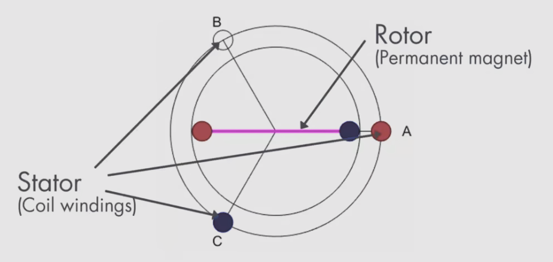
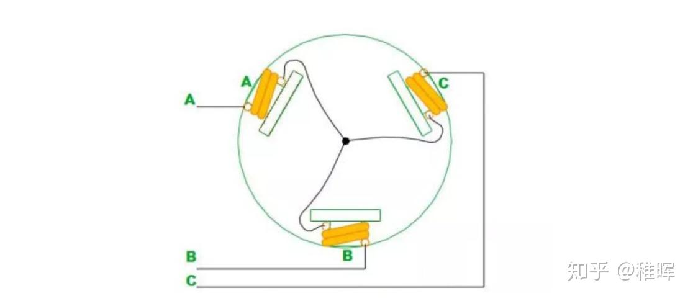
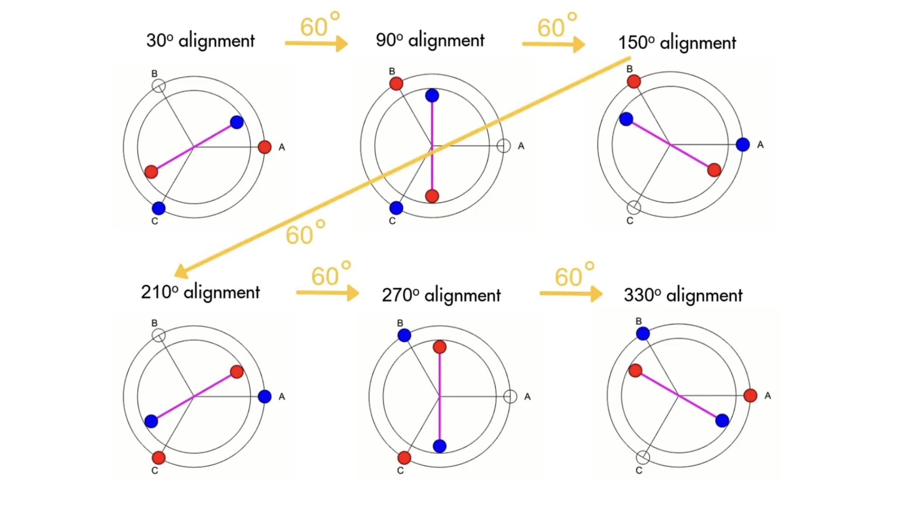
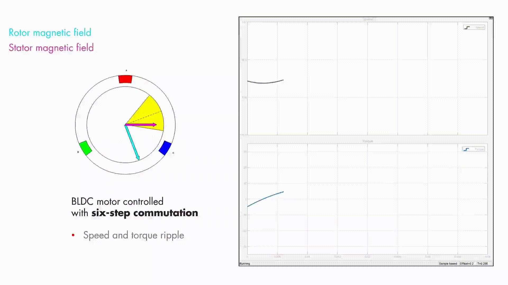
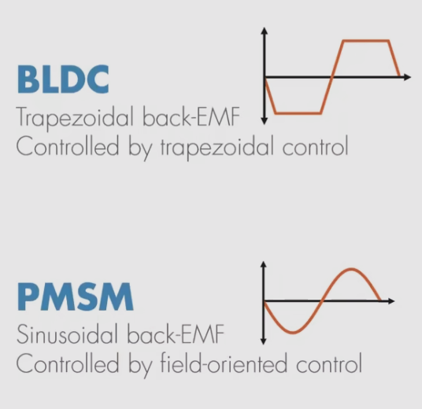
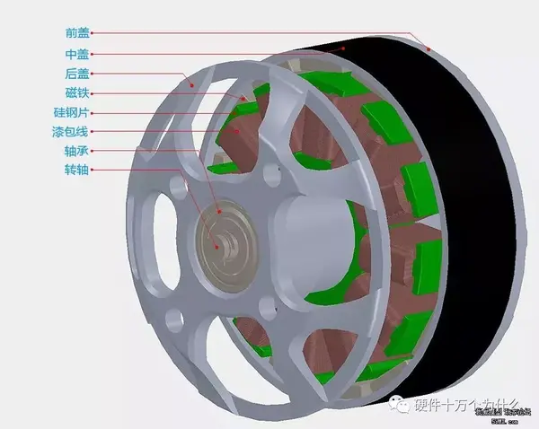
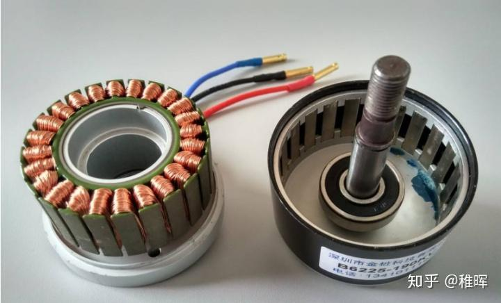

# Section 1 无刷电机的工作原理

> 转载请标明[出处](https://github.com/dokee39/HinaDrive).  
> Copyright: Please indicate the [source](https://github.com/dokee39/HinaDrive). 

## 无刷电机是如何转动的

有关高中物理知识,  此处不再赘述,  相信你对基本的电磁学知识已经相当熟悉了. 如果有些遗忘,  请 [Google](https://www.google.com/) 以下关键词: 
- 磁场
- 电磁感应
- 安培力
- 右手螺旋定则
- 电动机
- 反电动势

简单而言,  电机通过电流产生的电磁力在定子和转子之间的相互作用使得转子转动. 如果读者手边有电机,  可以尝试把电机的三相线合在一起,  用手去转动电机会发现阻力明显比没有合在一起时大,  这就是因为在转动电机过程中产生了感生电动势,  从而产生电流,  磁场中电流流过导体又会产生和转动方向相反的力,  因此就感受到了阻力. 

参见 Wikipedia 上对[电动机的分类](https://zh.wikipedia.org/wiki/%E7%94%B5%E5%8A%A8%E6%9C%BA#%E7%A8%AE%E7%B1%BB),  我们常见的无刷电机一般可以分为两种,   一种是[直流无刷电机](https://zh.wikipedia.org/wiki/%E7%9B%B4%E6%B5%81%E7%84%A1%E5%88%B7%E9%9B%BB%E5%8B%95%E6%A9%9F) **BLDC** (Brushless DC motor),   常用于航模上作为无人机桨叶的电机; 另一种是[永磁同步电机](https://zh.wikipedia.org/wiki/%E6%B0%B8%E7%A3%81%E5%90%8C%E6%AD%A5%E9%A6%AC%E9%81%94) **PMSM** (permanent-magnet synchronous motor). 他们在结构上大同小异. BLDC 和 PMSM 都是**同步电机**,  转子为永磁体. 它们的主要区别是其**反电动势**的形状. 

考虑一个最简单的三相二极三槽无刷电机模型: 

- 三相: 指电机驱动电流的相数,  虽然还有五相,  六相等多相电机,  但不在本教程的讨论范围内
- 二极: 指**转子** (Rotor) 的极数,  图中的转子为一个永磁体,  红色为 N 极,  蓝色为 S 极
- 三槽: 指**定子** (Stator) 的槽数,  定子为线圈,  三个线圈需要以一定的方式放在三个槽中

定子线圈可以通过通电控制其朝向转子一面的磁极. 定子线圈常用星形连接方式,  示意图如下: 

不难看出,  只要对其中的两个线圈分别施加正电压与负电压,  就可以使一个线圈的磁极为 N 极,  另一个为 S 极. 永磁体 (转子) 受到通电线圈的作用,  会对齐到与两个磁极平行的位置: 

如图所示, 定子与转子有 6 种不同的对齐方式, 彼此之间间隔 60 度. 这意味着, 如果能够每隔 60 度进行正确的换向, 就可以使电机旋转起来, 这称为**六步换向**或**梯形控制**,  这是 BLDC 常用的控制方式. 

理想状态下 (电枢反应电动势比较小), 转矩峰值出现在两个磁场正交时候, 而在两磁场平行 (对齐) 时最弱. 换向的方式是：转子永远不与定子磁场对齐, 而是始终追逐它: 
- 当定子与转子磁场完全对准时, 电机产生零扭矩
- 当定子与转子磁场互成 90 度时, 电机产生最大扭矩
- 因此目标是使该角度接近 90 度

## BLDC 与 PMSM 的区别

从上面的分析也容易想到,  由于转动过程中两个磁场的夹角在 60 度 ~ 120 度之间来回变化,  会导致旋转过程中扭矩的抖动. 对于上面的三相二极无刷电机,  转一圈就会抖 6 次. 为了解决这个问题,  有两种方法: 
- BLDC: 增加电机的磁极对数
- PMSM: 使两个磁场间的角度一直保持 90 度

### BLDC

增加电机的磁极对数很好理解,  原来是一圈抖 6 次,  现在我可以增加到一圈抖 66 次,  只要抖的足够快你就感受不到抖 (笑). 实际中买到的 BLDC 电机也基本都是多极对的 (比如下图),  BLDC 也可以结合抗齿槽算法的 FOC 进行力矩补偿实现平滑控制. 

虽然极对数变多了,  但是原理跟之前的分析是一样的. 

### PMSM

在 BLDC 的控制中,  电压从一相换到另一相上,  这个过程中,  电压的变化是阶跃式的,  也就是说可以认为用来驱动 BLDC 的是方波. 

实际上,  电机被旋转时起到发电机的作用, 这意味着定子中感应到反电动势电压, 该电压与电机的驱动电压相反. 反电动势是电机的一个重要特征, 通过观察其形状可以知道电机的类型以及应该用什么样的控制算法. 

为了适应梯形控制的方法,  BLDC 的反电动势被设计为梯形；而 PMSM 的反电动势为正弦, 一般采用磁场定向控制. 

既然可以使用正弦波驱动,  那么我们就可以使用正弦波提供一个始终与转子磁场垂直的定子磁场,  这样不仅解决了抖动问题,  还使电机的产生的转矩保持最大. 

这就是 **[FOC](https://zh.wikipedia.org/wiki/%E5%90%91%E9%87%8F%E6%8E%A7%E5%88%B6)**,  也是控制 PMSM 的常用方法. 你可能已经迫不及待地想要知道它的实现原理了,  也或许会疑惑比如正弦波怎么产生,  怎么才能知道转子的位置,  这就请看后续章节的详细介绍吧. 

## 实际使用的无刷电机

实际的无刷电机的结构如下图所示: 

这里有一些需要注意的地方: 
- 常见的无刷电机的永磁体 (转子) 在外面,  即外贴式无刷电机
- 硅钢片
    - 是有槽无刷电机的重要组成部分,  降低磁阻,  参与[磁路](https://zh.wikipedia.org/wiki/%E7%A3%81%E8%B7%AF)运转
    - 无槽无刷电机没有硅钢片的适用于一些特殊领域
    - 硅钢片是一片一片叠起来的,  为了减小[涡流损耗](https://zh.wikipedia.org/wiki/%E9%90%B5%E6%90%8D#%E6%B8%A6%E6%B5%81%E6%90%8D)
    - 高 KV 电机在全油门空转的情况下下会发热,  产生热量的正是涡流损耗和磁滞损耗
- 实际的电机不一定是三个槽对应一个磁极对
    - 比如常用的小型 BLDC 有 12 槽 7 磁极对的 (12N14P,  2212 电机)
    - 这样设计是为了减小齿槽转矩,  减小转矩脉动
    - 一般所说的极对数是指永磁体的极对数,  因为这与电转速和机械转速的比例有关

## Feedback

感谢阅读本教程! 我们希望能不断改进和完善这份文档, 如果在学习过程中遇到任何问题, 或有任何建议, 请随时[提出](https://github.com/dokee39/HinaDrive/issues/new?labels=question&template=question---.md). 感谢你的支持和帮助, 让我们一起学习和进步喵~

## Reference

- [【自制 FOC 驱动器】深入浅出讲解 FOC 算法与 SVPWM 技术 - 知乎](https://zhuanlan.zhihu.com/p/147659820)
- [无刷电机的工作原理, 动图演示, 一目了然 - 知乎](https://zhuanlan.zhihu.com/p/72091265)
- [【MATLAB官方教程】FOC电机控制](https://www.bilibili.com/video/BV1W94y1f7QZ)
- [无刷电机控制概述 - ESP-IoT-Solution](https://docs.espressif.com/projects/esp-iot-solution/zh_CN/latest/motor/bldc/bldc_overview.html)
