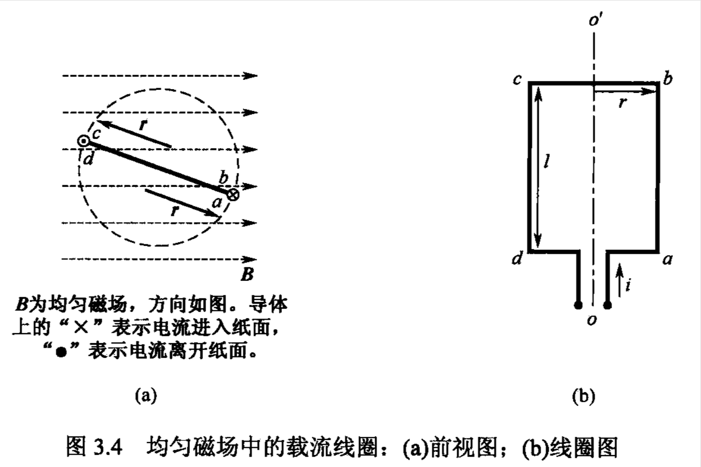
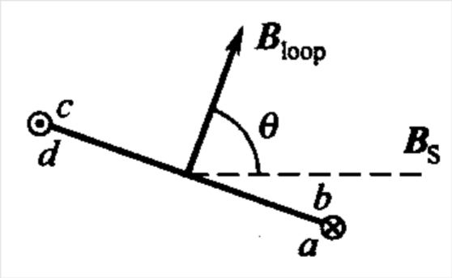
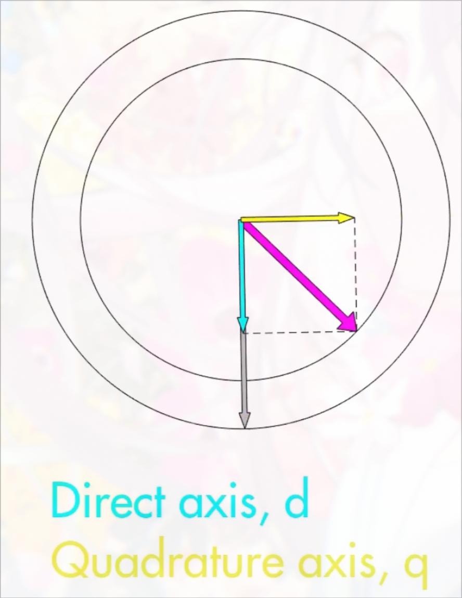
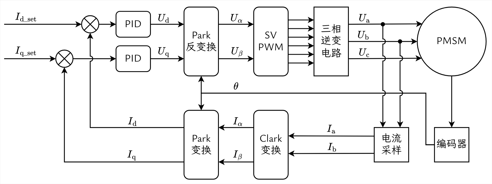

# Section 2 磁场定向控制 (FOC) 引入

> 转载请标明[出处](https://github.com/dokee39/HinaDrive).  
> Copyright: Please indicate the [source](https://github.com/dokee39/HinaDrive). 

## 引言

从这一部分开始, 我们将专注于讨论 PMSM 的控制方法, 即 FOC. 有关 BLDC 的控制方法详见后续相关章节. 

在前面的无刷电机控制概述中, 对于 PMSM 的控制有这样的说法: 
> 可以使用正弦波提供一个始终与转子磁场垂直的定子磁场

通过概述, 你应该了解 PMSM 控制旨在于让电机可以始终保持一个最大的, 恒定的转矩, 从而达到没有抖动的精细控制的效果. 为了解释清楚上述概念以及 FOC 控制的思想, 我们先稍微学习一下电机学的有关知识. 

## 旋转磁场与电磁转矩

### 两个磁场产生的转矩

回顾一下高中物理知识, 如图所示, 考虑一个均匀磁场中的载流线圈的受力情况, 该线圈中各边的受到的作用力为: 

$$\displaystyle{ \boldsymbol{ F } = i \left( \boldsymbol{ l } \times \boldsymbol{ B } \right) }$$

其中 $\displaystyle{ \boldsymbol{ l } }$ 的方向定义为该段导体上电流的方向. 

容易推断得到, ab 段受垂直向下的作用力, cd 段受垂直向上的作用力, 而 bc 与 da 段受力对线圈的旋转不起作用. 可以预想线圈会向与磁场垂直的平面旋转. 

线圈中通过的电流也会产生磁场. 定义线圈产生的磁场的磁通密度矢量为 $\displaystyle{ \boldsymbol{ B } _{ \text{loop} } }$, 空间中的均匀磁场的磁通密度矢量为 $\displaystyle{ \boldsymbol{ B } _{ \text{S} } }$, 它们之间的夹角为 $\displaystyle{ \theta }$, 带入上面的安培力定律公式, 不难得出线圈受到的力矩为: 

$$\displaystyle{ \tau = 2 ri l B _{ \text{S} } \sin \theta }$$

可以看出当两磁场间夹角为 90 度时受到的力矩最大, 而当两磁场平行时力矩为 0. 为了更清晰地表示出两磁场间的作用, 我们将上式中和线圈本身有关的参数替换掉. 已知 $\displaystyle{ B _{ \text{loop} } \propto i }$, 则有 $\displaystyle{ \tau = k B _{ \text{loop} } B _{ \text{S} } \sin \theta }$, 其中 $k$ 为一常系数. 上式写成叉积形式为: 

$$\displaystyle{ \boldsymbol{ \tau } = k \boldsymbol{ B } _{ \text{loop} } \times \boldsymbol{ B } _{ \text{S} } }$$

分析上式可以得出, 和两块永磁体靠近时类似, **两个磁场将会产生一个趋向于将两磁场对齐的转矩**. 对于无刷电机来说, **一个磁场由定子线圈产生, 另一个磁场由电机的转子永磁体产生, 那么转子上就会产生一个电磁转矩, 该转矩推动转子旋转, 趋向于使转子磁场与定子磁场对齐**. 

### 电磁转矩与线圈中电流的关系

如果保持转子磁场 $\displaystyle{ \boldsymbol{ B } _{ \text{R} } }$ 与定子磁场 $\displaystyle{ \boldsymbol{ B } _{ \text{S} } }$ 之间的夹角始终为 **90 度**, 那么此时**转子受到的电磁转矩最大**, 又由于永磁体电机中 $\displaystyle{ \boldsymbol{ B } _{ \text{R} } }$ 的大小恒定, 因此可以得到**转子受到的电磁转矩大小 $\displaystyle{ \tau }$ 与线圈中通过的电流大小 $\displaystyle{ i }$ 成正比**, 即: 

$$\displaystyle{ \tau = K _{ \tau } \cdot i }$$

其中 $\displaystyle{ K _{ \tau } }$ 为转矩常数, 这与直流有刷电动机是一致的. 

类似上面的推导过程还可以得出无刷电机的感应电动势为: 

$$\displaystyle{ E = K _{ E } \cdot \omega }$$

其中 $K_E$ 为反电动势常数, $\displaystyle{ \omega }$ 为电机的转速, 上式表明**定子线圈中的反电动势大小 $\displaystyle{ E }$ 与电机的转速成正比**. 这两个式子是电机学中的重要公式. 

PS: 无刷直流电动机称为 "直流电动机", 是由于其许多特性和有刷直流电动机相似, 但是实际上无刷直流电动机是一种交流电动机. 

### 三相交流电产生旋转磁场

**如果使用某种方法能够使定子磁场旋转起来, 那么转子上的电磁转矩就会推动转子沿圆周方向持续 "追赶" 定子磁场**. 这是所有交流电动机的工作原理. 

无刷电机的定子磁场是向定子绕组线圈中通电产生的. 对于单个的定子线圈, 使其通入幅值呈正弦形式变化的电流, 那么线圈将产生幅值呈正弦形式变化的电场. 现在将三个线圈相间 120 度放置, 向线圈中通入幅值呈正弦形式变化的, 相位相差 120 度的电流, 线圈将产生三个相间 120 度方向的幅值呈正弦形式变化的电场, 神奇的是, 这三个磁场叠加起来, 正好形成了一个幅值不变的**旋转磁场**. 旋转磁场的可视化如上面的动图所示, 感兴趣的读者可以从数学上证明. 

如果反过来使转子以恒定速度旋转, 即让定子线圈处在一个幅值不变的旋转磁场中, 那么线圈中将感应出三个相位相差 120 度的感应电动势. 

前面的论述实际上假设了定子的内腔为空的, 且线圈产生的磁通密度方向垂直于线圈平面, 实际电机中由于铁磁体的存在, 电机中磁通的分布要复杂得多, 但上面的论述可以作为对无刷电机内部磁场的一个定性的理解. 相要深入了解的读者可以参考电机学等相关书目. 

虽然实际电机中的磁场分布较为复杂, 但为了使电机适应 FOC 的控制方法, 电机的设计者们仍然尽力使电机的反电动势呈正弦波. 

### 多磁极对电机电频率与旋转磁场转速之间的关系

实际使用的无刷电机的转子一般都不止有一个磁极对, 而是多磁极对的. 对于磁极对数为 $\displaystyle{ \frac{ P }{ 2 } }$ 的电机, 转子旋转一圈, 定子线圈上产生 $\displaystyle{ \frac{ P }{ 2 } }$ 个周期的正弦波反电动势. 反过来也就是说, 定子线圈上通过时间为一个周期的正弦波, 旋转磁场转过的角度为 $\displaystyle{ \frac{ 2 }{ P } }$ 周. 可见无刷电机通过三相电的**电频率与旋转磁场转速是成倍数关系的**. 电频率 $\displaystyle{ f _{ \text{se} } }$ 与 旋转磁场旋转频率 $\displaystyle{ f _{ \text{sm} } }$ 的关系为: 

$$\displaystyle{ \begin{aligned}f _{ \text{se} } & = \frac{ P }{ 2 } f _{ \text{sm} }\end{aligned} }$$

## 磁场定向控制 (FOC)

### FOC 算法的流程

**磁场定向控制 (FOC, field-oriented control)**, 也称**矢量控制 (vector control)**, 是一种广泛应用于永磁同步电机控制的技术. FOC 通过控制电机的磁场, 使定子磁场方向始终与转子磁场方向保持正交, 从而实现高效和精确的电机控制. 

所谓电机控制, 最终目的无非是控制电机的转速或位置, 更直接地, 我们需要控制的是电机的输出扭矩. 在上文中我们已经指出电机的输出扭矩是有定子磁场与转子磁场的相互作用产生, 而为了获得无抖动的最大的扭矩, 我们需要控制定子磁场与转子磁场角度为 90 度. 到这里整个 FOC 算法的流程已经很明朗了: 
1. 测量转子位置 -> **编码器**
2. 根据定子磁场的期望方向计算出三相电流 -> **Clark & Park 变换**
3. 控制三相电流产生期望的定子磁场 -> **SVPWM**

### Clark & Park 变换的作用

编码器获得转子磁场的位置, SVPWM 产生了三相电, 这两个比较好理解, 先不展开介绍. 但是知道需要什么样的转子磁场不就知道了需要什么样的三相电流吗, 为什么需要 Clark & Park 变换这个环节呢? 为了理解整个 FOC 的流程, 我们先介绍一下为什么需要 Clark & Park 变换. 

我们需要控制三相电流, 以便能够控制电机的速度和扭矩. 但别说控制三个交流电流了, 对于 "控制" 这个领域来说, 我们压根就不想和正弦波这种高阶信号打交道, 要 PID 稳定跟踪正弦信号? 牡蛎~ 

能不能简单点跟踪一条直线 (常量) 呢? 仔细观察一下, 三相交流电之间是存在某种耦合关系的, 那么我们只要提取出这样的关系, 不久可以不用和麻烦的三相电打交道了吗? Clark & Park 变换就是做这样的事情的. 

还是回到定子磁场和转子磁场上来, 图中灰色的是编码器获得的转子位置, 洋红色的是实际产生的定子磁场. 我们需要的定子磁场是垂直于转子磁场的, 沿着转子磁场将定子磁场正交分解, 那么图中沿转子磁场的这一部分定子磁场分量对产生电磁转矩是没有贡献的. 我们将沿转子磁场的轴称为**直轴** (Direct axis), 垂直转子磁场的轴称为**交轴** (Quadrature axis), 那么可以说直轴分量是不需要的. 而 Clark & Park 变换就是将三相电流转换为直轴电流 $\displaystyle{ I _{ \text{d} } }$ 和交轴电流 $\displaystyle{ I _{ \text{q} } }$ 的. 当我们使用 Clark 和 Park 变换时, 三相电流将**从静止定子参考坐标转换为旋转转子参考坐标**, 也就是说, 我们不需要直接控制交流电流, 控制直流信号就可以, 即直轴和交轴电流. 使用 PID 控制直轴电流为 0, 以及相应大小的交轴电流, 就可以得到对应的三相电流了. 

### 电流采样

值得一提的是, 使用 PID 控制直轴和交轴电流, 需要获得实际的直轴和交轴电流作为参考值, 而实际的直轴和交轴电流由实际的三相电流经过 Clark & Park 变换计算得到. 因此, **电流采样**也是 FOC 中重要的一部分. 

### 完整的 FOC 流程图

上图就是完整的 FOC 流程图. 直角方框表示硬件电路, 圆角方框表示软件处理. 

FOC 目的是为了控制电机的输出力矩, 而前面我们提到输出力矩与电机中两磁场的相互作用有直接关系, **当定子磁场与转子磁场保持 90 度时, 电机通过的电流与输出的力矩成正比**, 因此控制电流就是控制力矩. 

在框图中, 我们进行电流采样, 反馈到 PID 控制器中进行电流的闭环控制, 所以可以说 FOC 整个流程其实是个**电流环**, 而为了将三相电流转换为可控的直流量, 我们**通过坐标变换相互耦合的三相磁链解耦为容易控制的直轴电流 $\displaystyle{ I _{ \text{d} } }$ 和交轴电流 $\displaystyle{ I _{ \text{q} } }$**, 所谓的 "矢量控制" 其实就是在做**解耦**. 

相信到了这里, 你已经能够理解 "磁场定向控制" 或 "矢量控制" 这个名字本身的含义. 对于流程图中每个环节的具体细节, 我们将在后续一一介绍. FOC 算法通过这种矢量控制方法, 实现了对电机转矩和速度的精确控制, 广泛应用于电动汽车, 工业机器人等需要高性能电机控制的领域. 

## Feedback

感谢阅读本教程! 我们希望能不断改进和完善这份文档, 如果在学习过程中遇到任何问题, 或有任何建议, 请随时[提出](https://github.com/dokee39/HinaDrive/issues/new?labels=question&template=question---.md). 感谢你的支持和帮助, 让我们一起学习和进步喵~

## References

- 谭建成, *永磁无刷直流电机技术*
- Chapman, *电机学*
- [【MATLAB官方教程】FOC电机控制](https://www.bilibili.com/video/BV1W94y1f7QZ)
