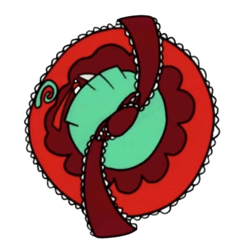
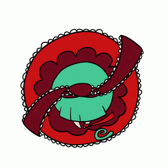
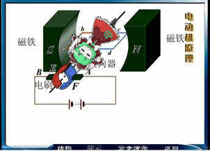

<!-- Improved compatibility of back to top link: See: https://github.com/othneildrew/Best-README-Template/pull/73 -->

<!--
*** Thanks for checking out the Best-README-Template. If you have a suggestion
*** that would make this better, please fork the repo and create a pull request
*** or simply open an issue with the tag "enhancement".
*** Don't forget to give the project a star!
*** Thanks again! Now go create something AMAZING! :D
-->

<!-- PROJECT SHIELDS -->
<!--
*** I'm using markdown "reference style" links for readability.
*** Reference links are enclosed in brackets [ ] instead of parentheses ( ).
*** See the bottom of this document for the declaration of the reference variables
*** for contributors-url, forks-url, etc. This is an optional, concise syntax you may use.
*** https://www.markdownguide.org/basic-syntax/#reference-style-links
-->
[![Contributors][contributors-shield]][contributors-url]
[![Forks][forks-shield]][forks-url]
[![Stargazers][stars-shield]][stars-url]
[![Issues][issues-shield]][issues-url]
[![MIT License][license-shield]][license-url]

<!-- PROJECT LOGO -->
 

  

<h3 align="center">HinaDrive</h3>

  

    FOC You Can Easily Make
     
    <a href="https://github.com/dokee39/HinaDrive/tree/master/0.Docs"><strong>Explore the docs »</strong></a>
     
     
    <a href="https://github.com/dokee39/HinaDrive">View Demo</a>
    ·
    <a href="https://github.com/dokee39/HinaDrive/issues/new?labels=bug&template=bug-report---.md">Report Bug</a>
    ·
    <a href="https://github.com/dokee39/HinaDrive/issues/new?labels=enhancement&template=feature-request---.md">Request Feature</a>
  

<!-- TABLE OF CONTENTS -->

  
Table of Contents

  <ol>
    <li>
      <a href="#about-the-project">About The Project</a>
      <ul>
        <li><a href="#built-with">Built With</a></li>
      </ul>
    </li>
    <li>
      <a href="#getting-started">Getting Started</a>
      <ul>
        <li><a href="#prerequisites">Prerequisites</a></li>
        <li><a href="#installation">Installation</a></li>
      </ul>
    </li>
    <li><a href="#usage">Usage</a></li>
    <li><a href="#roadmap">Roadmap</a></li>
    <li><a href="#contributing">Contributing</a></li>
    <li><a href="#license">License</a></li>
    <li><a href="#contact">Contact</a></li>
    <li>
        <a href="#acknowledgments">Acknowledgments</a>
        <ul>
            <li><a href="#projects">Projects</a></li>
            <li><a href="#reference">Reference</a></li>
        </ul>
    </li>
  </ol>

<!-- ABOUT THE PROJECT -->
## About The Project

> [Keep It Simple & Stupid](https://en.wikipedia.org/wiki/KISS_principle) -- baka

⣠⠤⡀⠀⠀⠀⠀⠀⠀⠀⠀⠀⠀⠀⠀⠀⠀⠀⠀⣀⣀⠀⠀   ⠀⠀⡜⠁⠀⠈⢢⡀⠀⠀⠀⠀⠀⠀⠀⠀⠀⠀⠀⢀⣴⠋⠷⠶⠱⡄  ⠀⢸⣸⣿⠀⠀⠀⠙⢦⡀⠀⠀⠀⠀⠀⠀⠀⢀⡴⠫⢀⣖⡃⢀⣸⢹  ⠀⡇⣿⣿⣶⣤⡀⠀⠀⠙⢆⠀⠀⠀⠀⠀⣠⡪⢀⣤⣾⣿⣿⣿⣿⣸  ⠀⡇⠛⠛⠛⢿⣿⣷⣦⣀⠀⣳⣄⠀⢠⣾⠇⣠⣾⣿⣿⣿⣿⣿⣿⣽  ⠀⠯⣠⣠⣤⣤⣤⣭⣭⡽⠿⠾⠞⠛⠷⠧⣾⣿⣿⣯⣿⡛⣽⣿⡿⡼  ⠀⡇⣿⣿⣿⣿⠟⠋⠁⠀⠀⠀⠀⠀⠀⠀⠀⠈⠙⠻⣿⣿⣮⡛⢿⠃  ⠀⣧⣛⣭⡾⠁⠀⠀⠀⠀⠀⠀⠀⠀⠀⠀⠀⠀⠀⠀⠈⢿⣿⣷⣎⡇  ⠀⡸⣿⡟⠀⠀⠀⠀⠀⠀⠀⠀⠀⠀⠀⠀⠀⠀⠀⠀⠀⠘⢿⣷⣟⡇  ⣜⣿⣿⡧⠀⠀⠀⠀⠀⡀⠀⠀⠀⠀⠀⠀⣄⠀⠀⠀⠀⠀⣸⣿⡜⡄  ⠉⠉⢹⡇⠀⠀⠀⢀⣞⠡⠀⠀⠀⠀⠀⠀⡝⣦⠀⠀⠀⠀⢿⣿⣿⣹  ⠀⠀⢸⠁⠀⠀⢠⣏⣨⣉⡃⠀⠀⠀⢀⣜⡉⢉⣇⠀⠀⠀⢹⡄⠀⠀  ⠀⠀⡾⠄⠀⠀⢸⣾⢏⡍⡏⠑⠆⠀⢿⣻⣿⣿⣿⠀⠀⢰⠈⡇⠀⠀  ⠀⢰⢇⢀⣆⠀⢸⠙⠾⠽⠃⠀⠀⠀⠘⠿⡿⠟⢹⠀⢀⡎⠀⡇⠀⠀  ⠀⠘⢺⣻⡺⣦⣫⡀⠀⠀⠀⣄⣀⣀⠀⠀⠀⠀⢜⣠⣾⡙⣆⡇⠀⠀  ⠀⠀⠀⠙⢿⡿⡝⠿⢧⡢⣠⣤⣍⣀⣤⡄⢀⣞⣿⡿⣻⣿⠞⠀⠀⠀  ⠀⠀⠀⢠⠏⠄⠐⠀⣼⣿⣿⣿⣿⣿⣿⣿⣿⡇⠀⠳⢤⣉⢳⠀⠀⠀  ⢀⡠⠖⠉⠀⠀⣠⠇⣿⡿⣿⡿⢹⣿⣿⣿⣿⣧⣠⡀⠀⠈⠉⢢⡀⠀  ⢿⠀⠀⣠⠴⣋⡤⠚⠛⠛⠛⠛⠛⠛⠛⠛⠙⠛⠛⢿⣦⣄⠀⢈⡇⠀  ⠈⢓⣤⣵⣾⠁⣀⣀⠤⣤⣀⠀⠀⠀⠀⢀⡤⠶⠤⢌⡹⠿⠷⠻⢤⡀  ⢰⠋⠈⠉⠘⠋⠁⠀⠀⠈⠙⠳⢄⣀⡴⠉⠀⠀⠀⠀⠙⠂⠀⠀⢀⡇  ⢸⡠⡀⠀⠒⠂⠐⠢⠀⣀⠀⠀⠀⠀⠀⢀⠤⠚⠀⠀⢸⣔⢄⠀⢾⠀  ⠀⠑⠸⢿⠀⠀⠀⠀⢈⡗⠭⣖⡒⠒⢊⣱⠀⠀⠀⠀⢨⠟⠂⠚⠋⠀  ⠀⠀⠀⠘⠦⣄⣀⣠⠞⠀⠀⠀⠈⠉⠉⠀⠳⠤⠤⡤⠞⠀⠀ ⠀⠀

放个 ⑨ 镇楼先, 欢迎 Watch 和 Star. 

Here's a blank template to get started.

(<a href="#readme-top">back to top</a>)

### Built With

(<a href="#readme-top">back to top</a>)

<!-- GETTING STARTED -->
## Getting Started

This is an example of how you may give instructions on setting up your project locally.  
To get a local copy up and running follow these simple example steps.

### Prerequisites

This is an example of how to list things you need to use the software and how to install them.

### Installation

(<a href="#readme-top">back to top</a>)

<!-- USAGE EXAMPLES -->
## Usage

Use this space to show useful examples of how a project can be used. Additional screenshots, code examples and demos work well in this space. You may also link to more resources.

_For more examples, please refer to the [Documentation](https://example.com)_

(<a href="#readme-top">back to top</a>)

<!-- ROADMAP -->
## Roadmap

- [ ] `0.Docs` 文档教程
    - [x] Section 1 无刷电机的工作原理
    - [ ] 电机选型/参数解释
    - [ ] 驱动版硬件
    - [ ] FOC 的原理, 代码
- [ ] 用 ODrive 的板子实现第一个 FOC
    - [ ] 期间调电流环之类的时候可以尝试学习仿真
- [ ] 实现自己的板子
    - [ ] 将功率板和控制板分开? 
    - [ ] 先用 STM32G4
    - [ ] 后面可以尝试 ESP32
- [ ] 兼容 BLDC
- [ ] 进阶的控制
    - [ ] 直接转矩控制
    - [ ] 无感方波
    - [ ] ...

See the [open issues](https://github.com/dokee39/HinaDrive/issues) for a full list of proposed features (and known issues).

(<a href="#readme-top">back to top</a>)

<!-- CONTRIBUTING -->
## Contributing

Contributions are what make the open source community such an amazing place to learn, inspire, and create. Any contributions you make are **greatly appreciated**.

If you have a suggestion that would make this better, please fork the repo and create a pull request. You can also simply open an issue with the tag "enhancement".  
Don't forget to give the project a star! Thanks again!

1. Fork the Project
2. Create your Feature Branch (`git checkout -b feature/AmazingFeature`)
3. Commit your Changes (`git commit -m 'Add some AmazingFeature'`)
4. Push to the Branch (`git push origin feature/AmazingFeature`)
5. Open a Pull Request

(<a href="#readme-top">back to top</a>)

<!-- LICENSE -->
## License

Distributed under the MIT License. See `LICENSE` for more information.

(<a href="#readme-top">back to top</a>)

<!-- CONTACT -->
## Contact

感谢阅读关注本项目! 我们希望能不断改进和完善这个项目, 如果在使用过程中遇到任何问题, 或有任何建议, 请随时[提出](https://github.com/dokee39/HinaDrive/issues/new?labels=question). 感谢你的支持和帮助, 让我们一起学习和进步喵~

Thank you for reading and following this project! We hope to continuously improve and perfect this project. If you encounter any problems or have any suggestions during use, please feel free to [raise them](https://github.com/dokee39/HinaDrive/issues/new?labels=question). Thank you for your support and help, let us learn and improve together~ nya~

dokee - [@dokeeちゃん](https://space.bilibili.com/355620078) - dokee.39@gmail.com

Project Link: [https://github.com/dokee39/HinaDrive](https://github.com/dokee39/HinaDrive)

(<a href="#readme-top">back to top</a>)

<!-- ACKNOWLEDGMENTS -->
## Acknowledgments

### Projects
- [SimpleFOC](https://github.com/simplefoc/Arduino-FOC)
- [DengFOC](https://github.com/ToanTech/Deng-s-foc-controller)

### Reference
- [【自制 FOC 驱动器】深入浅出讲解 FOC 算法与 SVPWM 技术 - 知乎](https://zhuanlan.zhihu.com/p/147659820)
- [无刷电机的工作原理, 动图演示, 一目了然 - 知乎](https://zhuanlan.zhihu.com/p/72091265)
- [【MATLAB官方教程】FOC电机控制](https://www.bilibili.com/video/BV1W94y1f7QZ)
- [无刷电机控制概述 - ESP-IoT-Solution](https://docs.espressif.com/projects/esp-iot-solution/zh_CN/latest/motor/bldc/bldc_overview.html)

(<a href="#readme-top">back to top</a>)

<!-- MARKDOWN LINKS & IMAGES -->
<!-- https://www.markdownguide.org/basic-syntax/#reference-style-links -->
[contributors-shield]: https://img.shields.io/github/contributors/dokee39/HinaDrive.svg?style=for-the-badge
[contributors-url]: https://github.com/dokee39/HinaDrive/graphs/contributors
[forks-shield]: https://img.shields.io/github/forks/dokee39/HinaDrive.svg?style=for-the-badge
[forks-url]: https://github.com/dokee39/HinaDrive/network/members
[stars-shield]: https://img.shields.io/github/stars/dokee39/HinaDrive.svg?style=for-the-badge
[stars-url]: https://github.com/dokee39/HinaDrive/stargazers
[issues-shield]: https://img.shields.io/github/issues/dokee39/HinaDrive.svg?style=for-the-badge
[issues-url]: https://github.com/dokee39/HinaDrive/issues
[license-shield]: https://img.shields.io/github/license/dokee39/HinaDrive.svg?style=for-the-badge
[license-url]: https://github.com/dokee39/HinaDrive/blob/master/LICENSE

